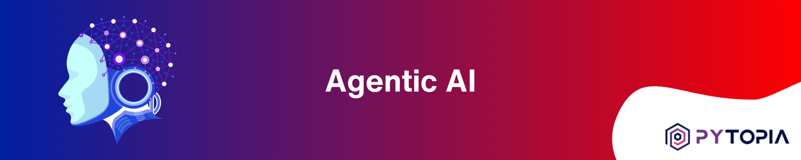

[](https://www.pytopia.ai)
[](https://t.me/pytopia_ai)
[](https://instagram.com/pytopia.ai)
[](https://www.youtube.com/c/pytopia)
[](https://linkedin.com/company/pytopia)
[](https://twitter.com/pytopia_ai)

Welcome to our comprehensive **Agentic AI with LlamaIndex** Course Repository. This cutting-edge course was designed for AI enthusiasts, developers, and professionals who want to master the art of building autonomous AI agents. From understanding the foundational concepts to deploying production-ready agentic systems, this course provides a complete journey into the world of autonomous artificial intelligence.

Our course is meticulously structured into eleven comprehensive modules:

- **Introduction to Agentic AI**: Understanding the evolution from LLMs to autonomous agents, core agent architectures, and the LlamaIndex framework.
- **Fundamentals of LlamaIndex**: Deep dive into LlamaIndex components, LLM integration, data ingestion pipelines, and vector embeddings.
- **Building Blocks of AI Agents**: Mastering tools, function calling, agent types, memory management, and human-in-the-loop patterns.
- **Designing Agent Workflows**: Creating sophisticated workflows with branching, loops, concurrent execution, and comprehensive observability.
- **Knowledge Retrieval for Agents**: Building RAG pipelines, advanced retrieval techniques, agentic RAG patterns, and vector database integration.
- **Tool Use and Function Calling**: Advanced tool creation, multi-tool coordination, and external API integration for enhanced agent capabilities.
- **Conversational Agents with LlamaIndex**: Developing chat engines, conversation management, and deploying conversational systems at scale.
- **Multi-Agent Systems**: Architecting systems with multiple agents, coordination patterns, and advanced multi-agent workflows.
- **Agent Evaluation and Testing**: Comprehensive evaluation frameworks, performance analysis, and quality assurance for production agents.
- **Advanced Agent Architectures**: Specialized agents for structured data extraction, code generation, and domain-specific applications.
- **Capstone Project**: Building a full-featured AI agent from planning to deployment, integrating all course concepts.

## 🤖 What You'll Build

Throughout this course, you'll develop practical skills by building:

- **Autonomous Research Agents** that can investigate topics and compile comprehensive reports
- **Customer Service Agents** capable of handling complex multi-step inquiries
- **Data Analysis Agents** that can process, analyze, and visualize information
- **Code Review Agents** for automated code quality assessment
- **Multi-Agent Systems** that coordinate to solve complex problems
- **Production-Ready Agents** with proper monitoring, evaluation, and deployment

## 🎯 Learning Outcomes

By the end of this course, you will:

- ✅ Master the LlamaIndex framework for building sophisticated AI agents
- ✅ Understand the historical evolution and theoretical foundations of agentic AI
- ✅ Implement the Thought-Action-Observation cycle in real applications
- ✅ Build agents that can use tools, access external APIs, and interact with databases
- ✅ Design and deploy multi-agent systems for complex problem-solving
- ✅ Create production-ready agents with proper evaluation and monitoring
- ✅ Apply best practices for agent security, reliability, and scalability

## 📋 Prerequisites

- **Python Programming**: Solid understanding of Python (intermediate level)
- **Basic AI/ML Knowledge**: Familiarity with machine learning concepts
- **API Experience**: Understanding of REST APIs and web services
- **Command Line**: Comfortable with terminal/command line operations

## 🛠️ Technologies Covered

- **LlamaIndex**: Primary framework for building AI agents
- **OpenAI GPT Models**: Integration with state-of-the-art language models
- **Vector Databases**: Pinecone, Chroma, Weaviate for knowledge storage
- **Python Libraries**: AsyncIO, FastAPI, Streamlit for agent deployment
- **Monitoring Tools**: Weights & Biases, LangSmith for agent observability
- **Cloud Platforms**: Docker, AWS/GCP for production deployment

# 📚 Learn with Us!

We also offer a [comprehensive course on Agentic AI](https://www.pytopia.ai/courses/agentic-ai) where learners can interact with peers and instructors, participate in live coding sessions, and get personalized feedback on their agent implementations. By registering for the course, you also gain access to our dedicated AI community and expert mentorship. Enroll now and start building the future of AI! Here are some useful links:

- [Agentic AI with LlamaIndex Course](https://www.pytopia.ai/courses/agentic-ai)
- [Pytopia AI Community Telegram Group](https://t.me/pytopia_ai)
- [Pytopia Website](https://www.pytopia.ai/)

[](https://www.pytopia.ai/courses/agentic-ai)

# 🚦 Getting Started

To start building AI agents with this repository:

1. **Clone the repository**:
   ```bash
   git clone https://github.com/pytopia/agentic-ai.git
   cd agentic-ai
   ```

2. **Set up your environment**:
   ```bash
   python -m venv venv
   source venv/bin/activate  # On Windows: venv\Scripts\activate
   pip install -r requirements.txt
   ```

3. **Configure API keys**:
   ```bash
   cp .env.example .env
   # Edit .env with your OpenAI API key and other credentials
   ```

4. **Start with Chapter 1**: Navigate to `Lectures/01 Introduction to Agentic AI/` and begin your journey!

5. **Follow the course structure**: Each chapter builds upon the previous one, so we recommend following the sequence.

## 📁 Repository Structure

```
Agentic-AI/
├── Lectures/                          # All course content
│   ├── 01 Introduction to Agentic AI/
│   ├── 02 Fundamentals of LlamaIndex/
│   ├── 03 Building Blocks of AI Agents/
│   ├── 04 Designing Agent Workflows/
│   ├── 05 Knowledge Retrieval for Agents/
│   ├── 06 Tool Use and Function Calling/
│   ├── 07 Conversational Agents with LlamaIndex/
│   ├── 08 Multi-Agent Systems/
│   ├── 09 Agent Evaluation and Testing/
│   ├── 10 Advanced Agent Architectures/
│   └── 11 Capstone Project - Building a Full-featured AI Agent/
├── images/                            # Course images and diagrams
├── convert_md_to_notebook.py          # Utility for converting markdown to notebooks
├── requirements.txt                   # Python dependencies
├── .env.example                       # Environment variables template
├── COURSE_STRUCTURE.md               # Detailed course outline
└── README.md                         # This file
```

## 🎓 Course Highlights

- **🕐 21 Hours of Content**: Comprehensive coverage from basics to advanced topics
- **📖 39 Interactive Lectures**: Each designed for optimal learning (10-45 minutes)
- **💻 Hands-on Projects**: Practical implementations in every chapter
- **🏗️ Production Focus**: Real-world deployment and scaling strategies
- **📚 Historical Context**: Understanding the evolution of AI agents
- **🔬 Latest Techniques**: Cutting-edge approaches and best practices

## 🤝 Contributing

We welcome contributions from the AI community! If you have improvements, additional examples, or new agent implementations you'd like to share:

1. Fork the repository
2. Create a feature branch (`git checkout -b feature/amazing-agent`)
3. Commit your changes (`git commit -m 'Add amazing agent implementation'`)
4. Push to the branch (`git push origin feature/amazing-agent`)
5. Open a Pull Request

Please ensure your contributions follow our coding standards and include appropriate documentation.

## 🏆 Community Showcase

Share your agent creations with the community! We love seeing what our students build:

- Tag us on social media with your agent demos
- Join our Telegram group to share your projects
- Contribute your best agents back to the repository
- Participate in our monthly agent challenges

## 📄 License

This course content is licensed under the MIT License. See the [LICENSE](LICENSE) file for details.

## 🙏 Acknowledgments

Special thanks to:
- **Jerry Liu** and the LlamaIndex team for creating an amazing framework
- **OpenAI** for advancing the field of language models
- **The AI research community** for continuous innovation
- **Our students and contributors** who make this course better every day

## 📞 Contact Information

Ready to start your journey into Agentic AI? Reach out to us!

- 🌐 Website: [pytopia.ai](https://www.pytopia.ai)
- 💬 Telegram: [pytopia_ai](https://t.me/pytopia_ai)
- 🎥 YouTube: [pytopia](https://www.youtube.com/c/pytopia)
- 📸 Instagram: [pytopia.ai](https://www.instagram.com/pytopia.ai)
- 🎓 LinkedIn: [pytopia](https://www.linkedin.com/company/pytopia)
- 🐦 Twitter: [pytopia_ai](https://twitter.com/pytopia_ai)
- 📧 Email: [pytopia.ai@gmail.com](mailto:pytopia.ai@gmail.com)

---

**Ready to build the future with AI agents? Let's get started! 🚀**
